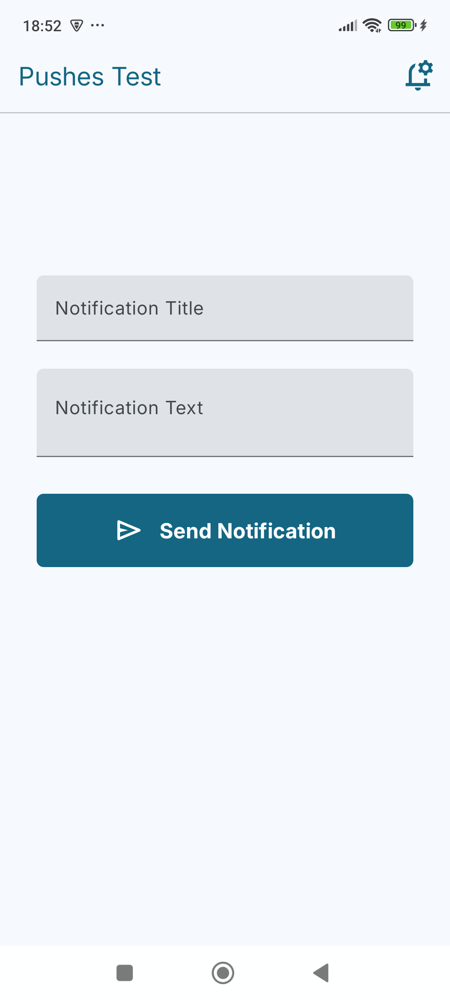
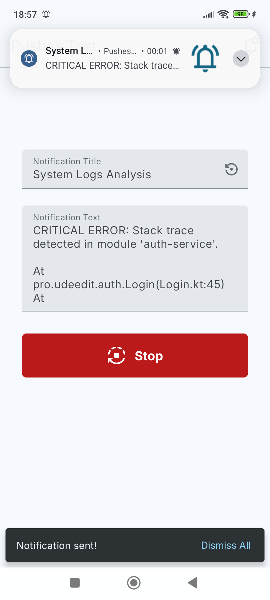
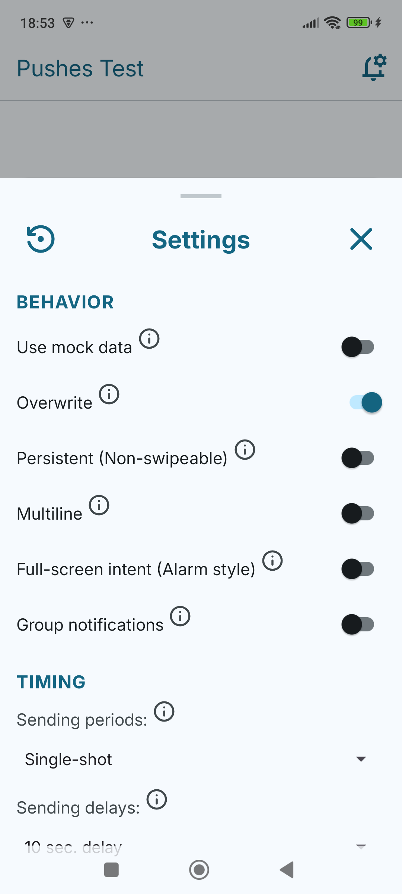
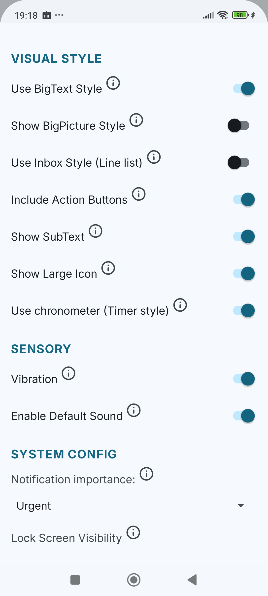
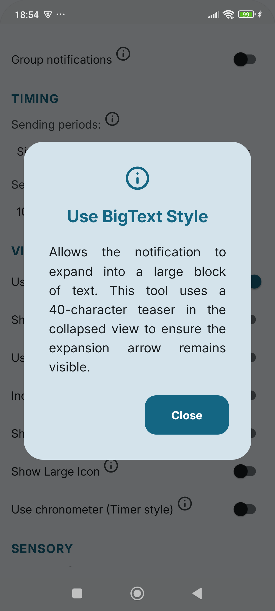
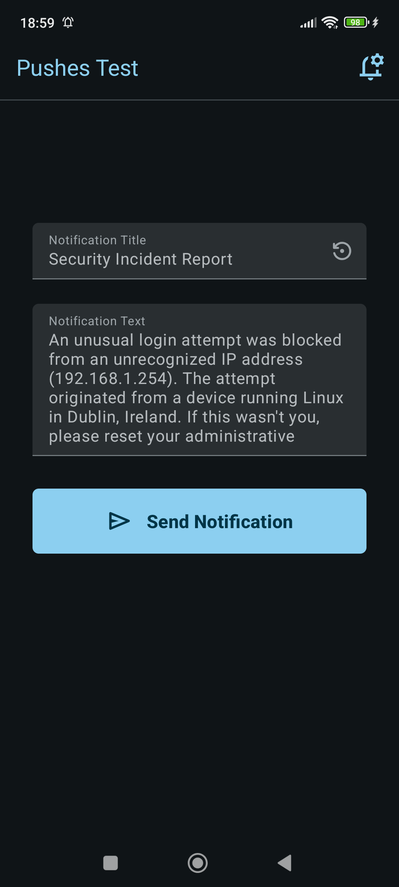
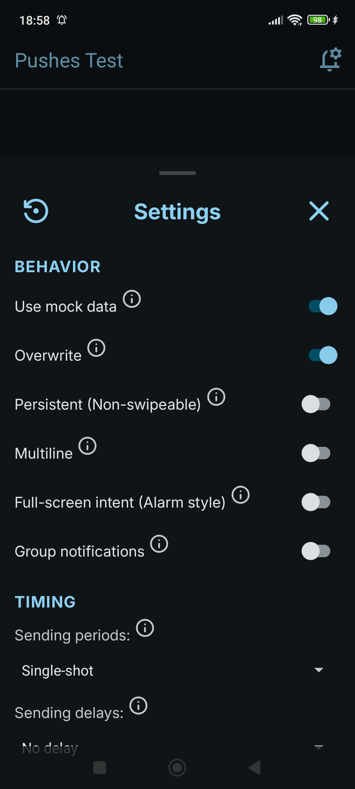
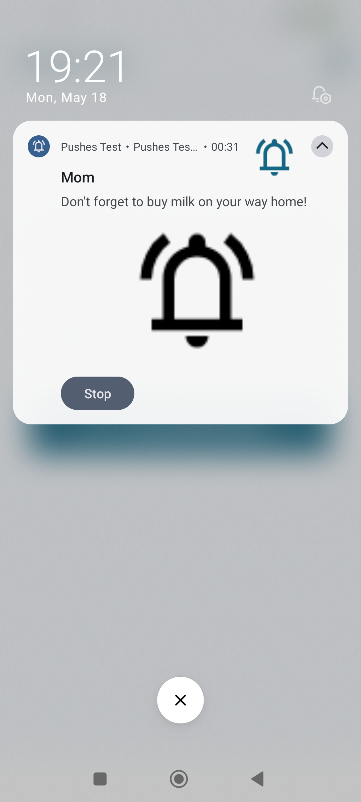

# Pushes Test (D2D Utility)

**Pushes Test** is a professional D2D (Developer-to-Developer) utility designed for deep testing of local Android notifications. It allows coders to simulate real-world scenarios, stress-test system behaviors, and master the nuances of the Android Notification API.

---

## 📸 Screenshots

  <b>Manual Entry & Periodic Stress-Testing</b> 
  
  

  <b>Advanced Configuration & D2D Documentation</b> 
  
  
  

  <b>High-Contrast Night Mode & Resulting Styles</b> 
  
  
  

  <i>Optimized for Phones & Tablets with Full Material 3 Support</i>

---

## 🚀 Pro Developer Features

### 🛠 Behavior & Stress Testing
- **Smart Mock Data:** Instantly populate notifications with real-world developer scenarios (GitHub PRs, Server Alerts, Security Logs).
- **Periodic Loops:** Stress-test device behavior by sending notifications at 10s, 30s, or 60s intervals with self-stopping background logic.
- **Full-Screen Intent:** Simulate high-priority alerts (Alarms/Calls) that wake up and take over the screen even when locked (Android 14+ compliant).
- **Smart Overwrite:** Toggle between updating a single notification ID or stacking multiple unique alerts.

### 🎨 Visual Styles Mastery
- **BigText Style:** Test expandable text blocks with our proprietary **40-character truncation logic** to ensure the expansion arrow remains visible.
- **BigPicture Style:** Verify hero images with automatic **XML-to-Bitmap conversion** and adaptive aspect-ratio padding to prevent cropping.
- **Inbox Style:** Simulate list-based notifications with intelligent multi-line chunking, bypassing the standard Android line-wrapping limitations.
- **Header Metadata:** Test combined App Name and **SubText hints** ("Expand for details") for maximum discoverability.

### 📱 Premium UX
- **Live Spring UI:** A highly interactive interface with haptic feedback and vertical "swag" animations.
- **Tablet Optimized:** A centered "Console" layout (500dp max-width) designed specifically for large screens and foldables.
- **Material 3 Design:** Built strictly with the latest M3 design system, supporting high-contrast Light and Dark modes with the **Inter** font family.
- **D2D Info System:** Built-in documentation via "i" icons to explain OS-specific quirks (like Xiaomi icon placement or Android 14 swipe rules).

---

## 🛠 Technologies & Architecture

- **Kotlin:** 100% Modern Kotlin codebase.
- **Material 3:** Full adoption of the latest M3 theme components.
- **Modular Architecture:** Clean separation of concerns using shared internal libraries:
    - `:anarchist` — Advanced runtime permission handling.
    - `:cushystorage` — High-performance data persistence.

---

## 🚦 Getting Started

### Prerequisites
- Android Studio Iguana or later.
- Device or Emulator running **Android 8.0+** (Android 15 recommended).
- **Permissions:** Ensure you allow "Post Notifications" and "Full-Screen Intents" in system settings to use the Pro features.

### Building
1. Clone the repository.
2. Open in Android Studio.
3. Sync Gradle and run on your device.

---

## 🗺 Roadmap (Upcoming Features)
- [ ] **Custom XML Layouts:** Adding support for `RemoteViews` to test full UI branding.
- [ ] **Modular Support:** Shared branding and support logic for the D2D suite.
- [ ] **Payload Export:** Copy notification JSON for backend testing.
- [ ] **Compose support:** Transfer to Jetpack compose for using the current best practice for Android development.

---

## 📜 License
This project is licensed under the **Apache License 2.0**. You are free to use the code for learning or within your own applications.

---
