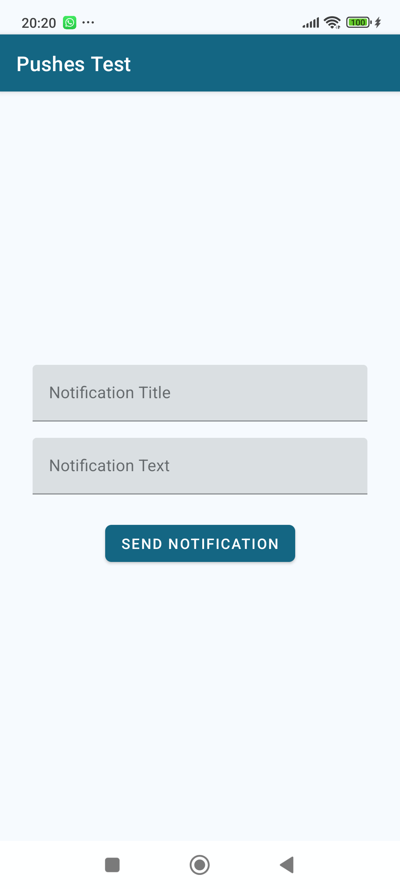
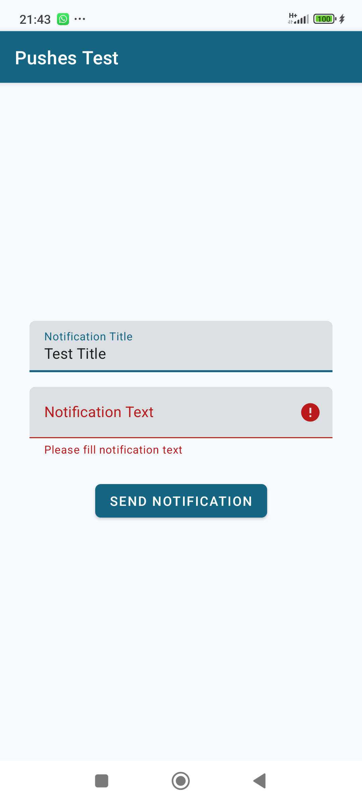
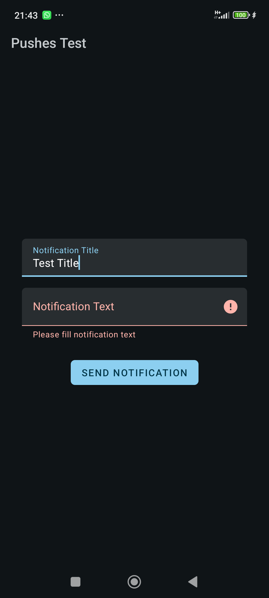
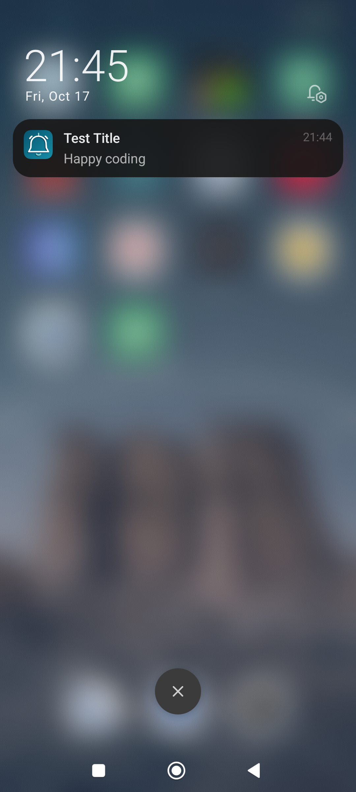

# Pushes Test

A simple Android application that demonstrates and tests local In-App Notifications. 
Easily send test notifications to verify notification layout, sound, and behavior.

---

## Features

- Send notifications with custom messages
- Demonstrate notification appearance and behavior
- Light and Dark modes
- Error Alerts if fields are empty 
- No external dependencies (only internal library), lightweight setup
- Own library (anarchist) for handling permissions is used
- Useful for testing notification permissions and settings

---

## Technologies Used

- [Kotlin](https://kotlinlang.org/)
- [NotificationCompat](https://developer.android.com/reference/androidx/core/app/NotificationCompat)

---

## Screenshots

---

## Getting Started

### Prerequisites

- Android Studio Arctic Fox or later
- Android device or emulator (Android 8.0+ recommended)
- Enable notification permissions if needed

### Building the App

1. Clone the repository:
2. Open the project in Android Studio.
3. Run the application on an Android emulator or physical device.

---

## Contributing

Thank you for your interest!  
Currently, we are **not accepting pull requests or external contributions**.

Please exclusively submit **bug reports** or **feature requests/suggestions** via GitHub issues.

We appreciate your understanding and support!

-------

## License

This project is licensed under the MIT License.

------

