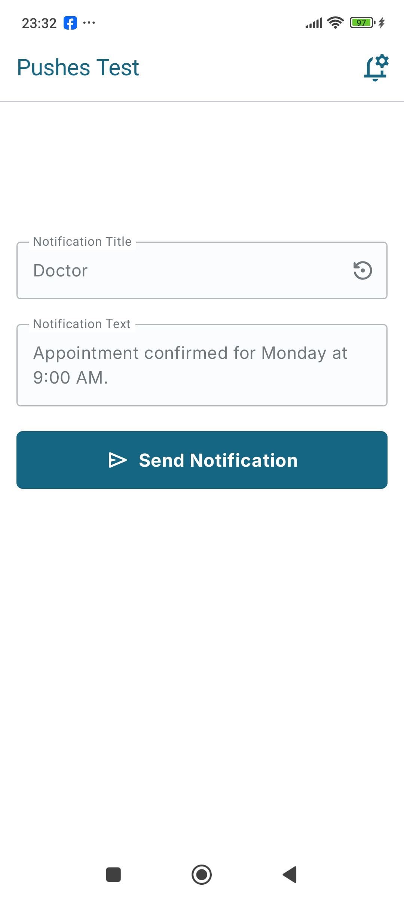
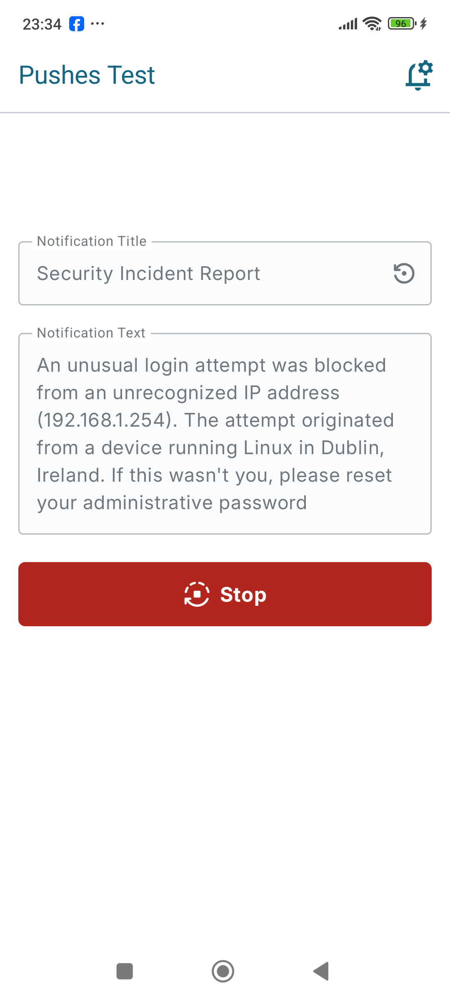
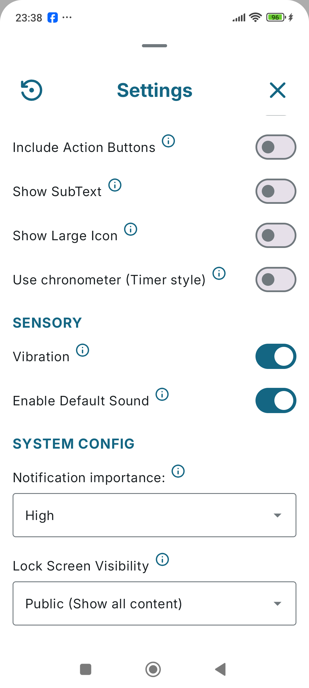
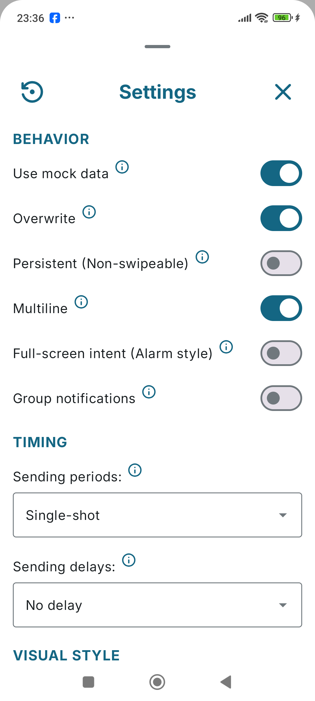
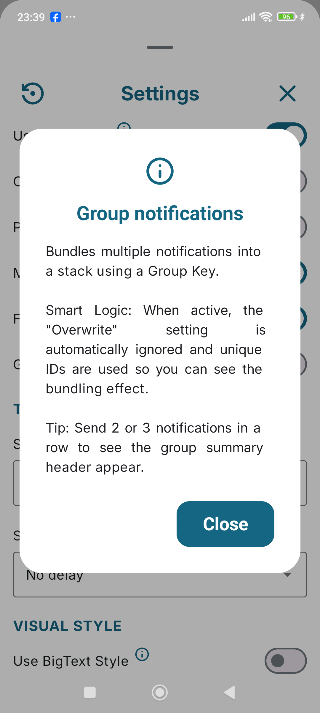
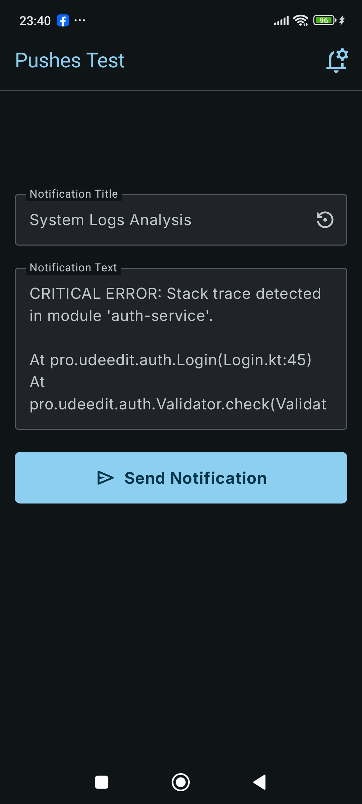
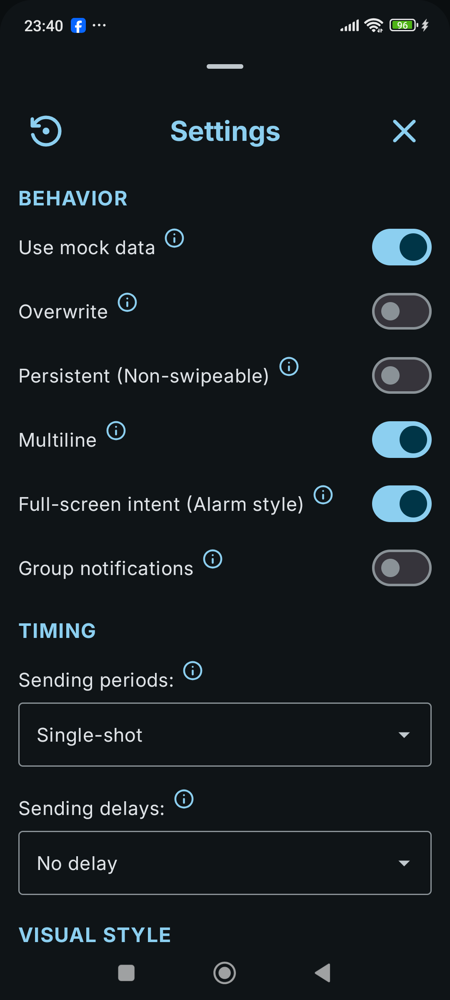
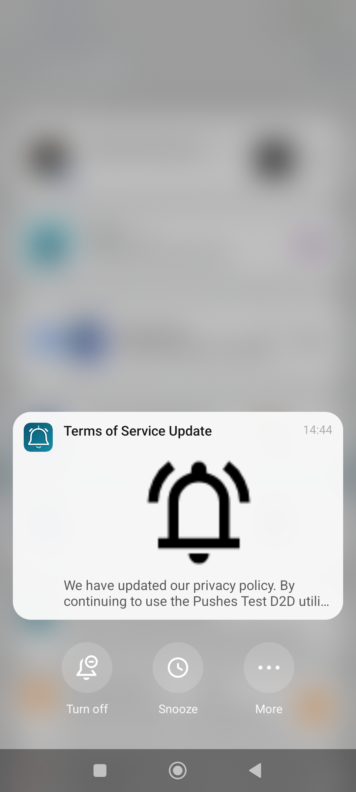

# Pushes Test (D2D Utility)

**Pushes Test** is a professional D2D (Developer-to-Developer) utility designed for deep testing of local Android notifications. It allows coders to simulate real-world scenarios, stress-test system behaviors, and master the nuances of the Android Notification API.

---

## 📸 Screenshots

  <b>Modern MVI & Compose UI</b> 
  
  

  <b>Advanced Configuration & D2D Documentation</b> 
  
  
  

  <b>High-Contrast Night Mode & Resulting Styles</b> 
  
  
  

  <i>Optimized for Phones & Tablets with Full Material 3 Support</i>

---

## 🚀 Pro Developer Features

### 🛠 Behavior & Stress Testing
- **MVI State Architecture:** Built with a single source of truth for all 20+ notification settings, ensuring predictable UI behavior.
- **Smart Mock Data:** Instantly populate notifications with real-world developer scenarios (GitHub PRs, Server Alerts, Security Logs).
- **Periodic Loops:** Stress-test device behavior by sending notifications at 10s, 30s, or 60s intervals with self-stopping background logic.
- **Full-Screen Intent:** Simulate high-priority alerts (Alarms/Calls) that wake up and take over the screen even when locked (Android 14+ compliant).

### 🎨 Visual Styles Mastery
- **BigText Style:** Test expandable text blocks with our proprietary **40/60 character truncation logic** to ensure the expansion arrow remains visible.
- **BigPicture Style:** Verify hero images with automatic **XML-to-Bitmap conversion** and adaptive aspect-ratio padding to prevent cropping.
- **Inbox Style:** Simulate list-based notifications with intelligent multi-line chunking, bypassing standard Android line-wrapping limitations.
- **Header Metadata:** Test combined App Name and **SubText hints** ("Expand for details") for maximum discoverability.

### 📱 Premium UX
- **Jetpack Compose UI:** 100% modern, declarative UI with fluid state transitions.
- **Live Spring UI:** A highly interactive interface with haptic feedback and spring-loaded "vertical swag" animations.
- **Tablet Optimized:** A centered "Console" layout (500dp max-width) designed specifically for large screens and foldables using Compose `widthIn` logic.

---

## 🛠 Technologies & Architecture

- **Kotlin:** 100% Modern Kotlin codebase.
- **Jetpack Compose:** Using the latest declarative UI standards.
- **Material 3:** Full adoption of the M3 design system with custom Inter typography.
- **Hilt & KSP:** Advanced Dependency Injection and high-performance Kotlin Symbol Processing.
- **Clean Architecture:** Logic encapsulated in Hilt-injected Use Cases and MVI ViewModels.
- **Modular Design:** Powered by internal libraries:
    - `:anarchist` — Advanced runtime permission management.
-**Dependencies:** Replaced ":cushystorage" library from internal module to Maven dependency:
    - `pro.udeedit.devtools:cushystorage:1.0.3`

---

## 📜 License
This project is licensed under the **Apache License 2.0**. You are free to use the code for learning or within your own applications.
